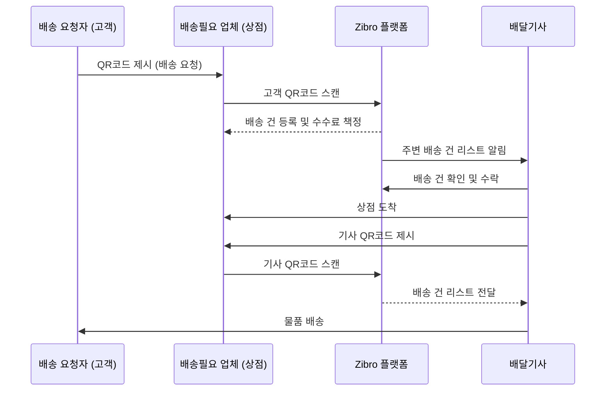
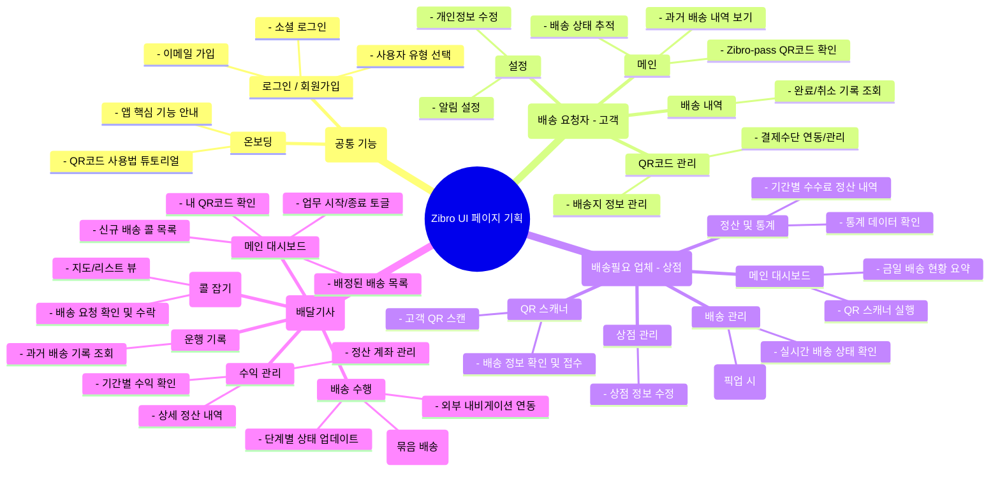

## 서비스는 배송서비스이다. 
- 배송 요청자, 배송필요 업체, 배달기사 3부류의 사용자가 있다. 
- 기본적인 서비스 flow는 배송필요 업체(시장, 마트 등)에서 배송 요청자(구매자)가 배송요청을 하면 배달기사가 배송하는 서비스이다. 
- 배송 요청자는 구매 후 배송을 원할 경우 업체에게 '집으로 플랫폼'을 통해 QR코드를 보여준다.
- 배송 요청자가 보여준 QR코드에는 배송 요청자의 정보(목적지 주소, 전화번호, 결제정보)등이 포함되어 있다. 
- 업체는 '집으로 플랫폼'을 통해 QR코드를 스캔하여 배송 건 등록을 한다.
- 업체가 스캔하면 해당 업체가 '출발지'가 되며 목적지는 스캔한 요청자 정보의 주소로 '목적지'를 설정한다.
- 업체가 배송 건 등록을 하면 '집으로 플랫폼'이 산정한 기준으로 배송 수수료가 책정된다.
- 배송기사는 일정 거리 주변의 배송 건 리스트를 확인하여 '출발지-목적지, 물품 내용' 등을 확인하여 배송 수락을 진행한다. 
- 배송기사는 효율적인 배송을 위해 유사한 출발지 및 목적지를 하나로 묶어 여러건 배송할 수 있도록 한다. 
- 배송기사는 업체에 도착하여 '배송기사 QR코드'를 업체의 '집으로 플랫폼'으로 스캔한다. 
- '배송기사 QR코드'가 스캔되면 업체가 요청한 배송 건 리스트를 해당 '배송기사'에게 전달한다.

각 배달 요청자/ 배송기사는 QR코드를 통해 요청 및 배송을 '원패스'로 할 수 있다. 
배달의 하이패스화 (Zibro패스) 서비스를 도입.

## 위 기본 서비스 내용을 기반으로 Flow 차트 구현 

## 해당 서비스의 핵심 기능과 시장의 기대효과를 도출

### 핵심 기능
- **QR코드 기반 원클릭 배송 접수**: 고객과 상점 모두의 편의성을 극대화하는 핵심 프로세스. 고객은 QR코드 제시만으로, 상점은 스캔 한 번으로 배송 접수를 완료합니다.
- **실시간 배송 매칭 시스템**: 배송 요청 발생 시, 플랫폼이 최적의 위치에 있는 배송기사에게 실시간으로 요청을 전달하여 신속한 배차를 가능하게 합니다.
- **묶음 배송 및 최적 경로 제안**: 배송기사가 동선이 비슷한 여러 배송 건을 한 번에 처리할 수 있도록 묶음 배송 기능을 지원하고, 최적화된 경로를 제안하여 배송 효율을 높입니다.
- **자동화된 요금 산정**: 거리, 물품, 시간대 등 다양한 요소를 고려한 표준화된 요금 체계를 자동으로 적용하여 투명하고 일관된 배송료를 보장합니다.
- **사용자 유형별 맞춤형 인터페이스**: '배송 요청자', '상점', '배송기사' 각자의 역할에 맞는 기능과 정보만 노출하는 직관적인 UI/UX를 제공합니다.

### 시장 기대효과
- **소상공인 디지털 전환 및 경쟁력 강화**: 자체적인 배송 시스템 구축이 어려운 전통시장, 동네 마트 등 소상공인들이 손쉽게 배송 서비스를 도입하여 온라인 대형 유통업체와 경쟁할 수 있는 기반을 마련합니다.
- **'라스트마일' 배송 혁신을 통한 고객 경험 향상**: 구매 현장에서 즉시 배송을 신청하는 '원패스' 경험은 고객의 쇼핑 편의성을 극대화하고, 빠른 배송으로 만족도를 높입니다.
- **유휴 노동력 활용 및 신규 일자리 창출**: 원하는 시간에 유연하게 일할 수 있는 배송 플랫폼을 통해 새로운 일자리를 창출하고, 지역 내 유휴 노동력을 효과적으로 활용합니다.
- **지역 경제 활성화**: 지역 내 소비와 배송이 선순환 구조를 이루면서, 대형 플랫폼에 집중되었던 소비를 지역 상권으로 유도하여 지역 경제에 활력을 불어넣습니다.
- **데이터 기반의 스마트 물류 생태계 구축**: 축적된 배송 데이터를 분석하여 수요 예측, 효율적인 자원 배분 등 물류 프로세스 전반을 고도화하고, 스마트한 지역 물류 생태계를 구축하는 데 기여합니다.

## 해당 서비스를 구현하기 위한 UI 페이지 기획

> 3가지 사용자 유형(고객, 상점, 배송기사)에 따라 최적화된 별도의 앱 또는 앱 내 모드를 제공하는 것을 전제로 기획합니다.

### 1. 공통 기능 / 페이지
- **로그인 / 회원가입**: 소셜 로그인(카카오, 네이버 등) 및 이메일 기반 회원가입을 지원하며, 가입 시 사용자 유형을 선택합니다.
- **온보딩**: 앱의 핵심 기능(특히 QR코드 사용법)을 사용자 유형에 맞게 안내하는 튜토리얼 페이지입니다.

### 2. 배송 요청자 (고객)용 UI
- **메인**: 자신의 'Zibro-pass' QR코드를 즉시 확인할 수 있으며, 현재 진행 중인 배송 상태를 추적하는 기능과 과거 배송 내역으로 연결됩니다.
- **QR코드 관리**: 배송지, 결제수단 등 QR코드에 연동된 개인 정보를 관리합니다.
- **배송 내역**: 완료되었거나 취소된 모든 배송 기록을 조회합니다.
- **설정**: 알림 수신 여부, 개인정보 수정 등 계정 관련 설정을 관리합니다.

### 3. 배송필요 업체 (상점)용 UI
- **메인 대시보드**: QR 스캐너 실행 버튼을 전면에 배치하고, 금일 배송 접수 현황(접수, 대기, 완료)을 요약하여 보여줍니다.
- **QR 스캐너**: 고객의 QR코드를 스캔하여 배송 정보를 자동으로 불러오고, 간단한 확인 절차 후 배송을 접수합니다.
- **배송 관리**: 접수된 모든 배송 건의 상태(기사 배정 대기, 픽업 대기 등)를 실시간으로 확인하고 관리합니다. 기사 픽업 시 기사 QR코드를 스캔하는 기능도 포함됩니다.
- **정산 및 통계**: 일/주/월별 배송 수수료 정산 내역과 관련 통계를 확인합니다.
- **상점 관리**: 상점의 기본 정보(위치, 운영시간 등)를 수정합니다.

### 4. 배달기사 (배송기사)용 UI
- **메인 대시보드**: 업무 시작/종료 상태를 변경하는 토글과 자신의 QR코드를 제공합니다. 현재 배정된 배송 목록과 주변의 신규 배송 '콜' 목록을 보여줍니다.
- **신규 배송 목록 (콜 잡기)**: 지도 또는 리스트 형태로 주변의 배송 요청을 확인하고, 조건(거리, 수수료 등)을 검토한 후 수락합니다.
- **배송 수행**: 배정된 배송 건(묶음 배송 포함)의 최적화된 픽업-배송 순서를 안내합니다. 각 단계(픽업 완료, 배송 완료)마다 상태를 업데이트하며, 외부 내비게이션 앱과 연동됩니다.
- **수익 관리**: 기간별 수익 및 상세 정산 내역을 확인하고, 정산 계좌를 관리합니다.
- **운행 기록**: 과거에 수행했던 모든 배송 기록을 조회합니다.

## UI 페이지 기획 마인드맵

